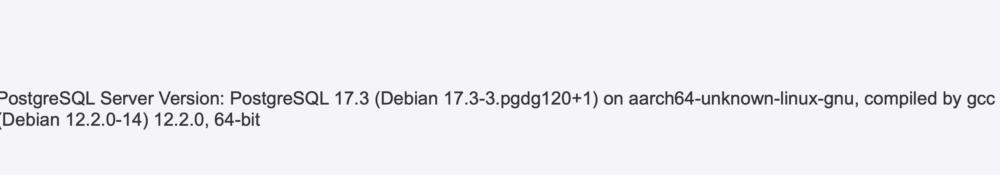

# Floki Node.js App

This is a simple Node.js application that connects to a PostgreSQL database.

## Prerequisites

- Node.js
- PostgreSQL
- Cloud Foundry CLI

## Deploying to Cloud Foundry
```sh
cf create-user-provided-service mypg -p '{"host":"your_host", "database":"your_db", "username":"your_username", "password":"your_password", "port":5432}'

## for on-demand service instance
export VCAP_SERVICES="$(cat vcap-services-full.json)"

cf push
```

## screenshot

